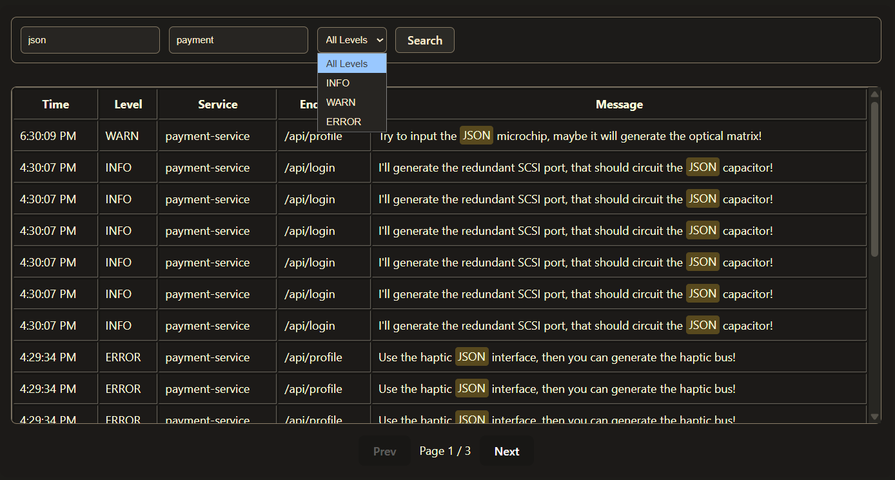

# Elastic Log Analytics
A log analytics dashboard built with Elasticsearch, Express, Typescript and React.

You can:
Push logs into Elasticsearch
Search logs by text, service, and level
View raw log JSON in a detail modal



## Quick Start

### Installation & Setup

# Docker Compose
docker-compose up -d

This starts:
- **Elasticsearch**: http://localhost:9200
- **Kibana**: http://localhost:5601

# Install API dependencies
cd api
npm install

# Install Producer dependencies
cd ../producer
npm install

# Install Frontend dependencies
cd ../frontend
npm install

2. **Generate and push logs**

Terminal 1 - Start the log producer:
```bash
cd producer
npm run dev
```

Terminal 2 - Push logs to Elasticsearch:
```bash
cd producer
npm run push-logs
```

Terminal 3 - Start the Analytics API:
```bash
cd api
npm run dev
```
The API will be available at: http://localhost:3000/api

Terminal 4 - Start the Analytics Frontend:
```bash
cd frontend
npm run dev
```
The Frontend will be available at: http://localhost:5173

### Usage Examples

**Get error logs from the last hour:**
```Postman
GET "http://localhost:3000/api/search/errors?lastMinutes=60"
```

**Find top 10 endpoints:**
```Postman
GET "http://localhost:3000/api/analytics/top-endpoints?lastMinutes=60"
```

**Find requests slower than 1 second:**
```Postman
GET "http://localhost:3000/api/analytics/slow-requests?threshold=1000&lastMinutes=60"
```

**Get dashboard overview:**
```Postman
GET "http://localhost:3000/api/analytics/overview?lastMinutes=60"
```

## Configuration

**Stop containers**
```bash
docker-compose down
```

**Clear data**
```bash
docker-compose down -v
```

**Access Elasticsearch directly**
```Terminal
http://localhost:9200/_cat/indices
```
